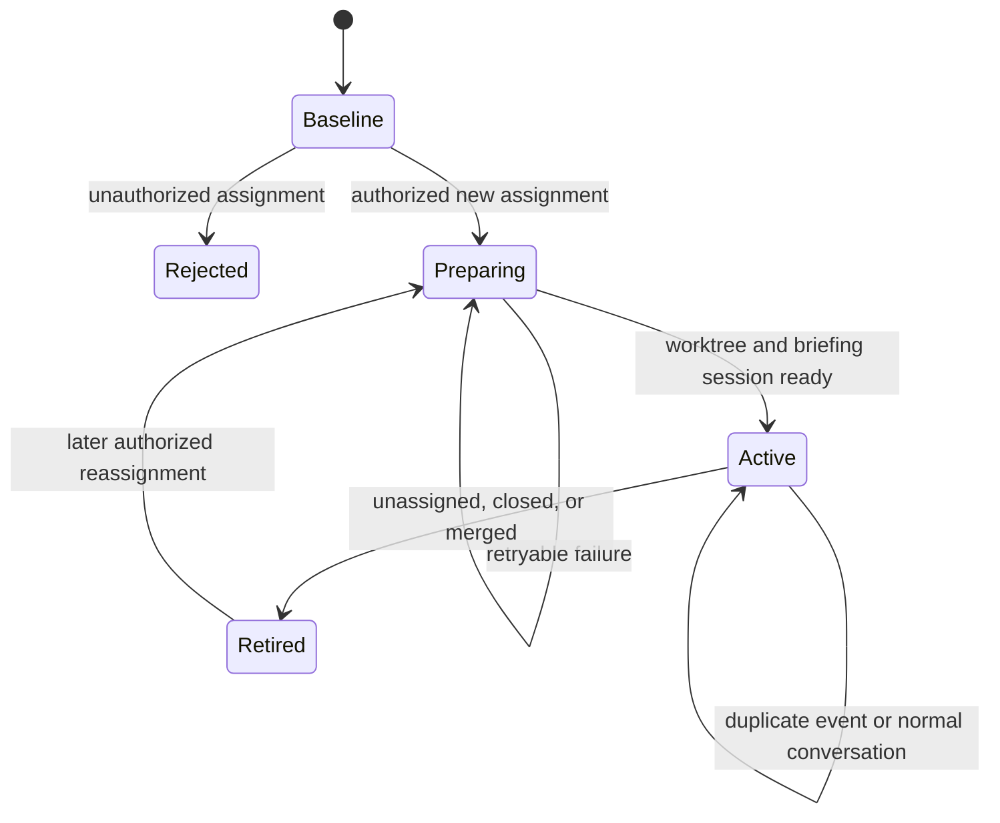

# GitHub Notifications Plan

Status: proposed

This document plans an Agent System-owned GitHub work-notification channel. It
describes intended behavior, not configuration accepted by the current release.

## Recommendation

Build this as three cooperating pieces rather than one privileged poller:

1. a GitHub assignment monitor discovers repository events and verifies their
   authority;
2. the existing Git worktree capability prepares the declared repository work
   area;
3. an `agent-system-github` inbound channel routes the accepted event into one
   deterministic OpenClaw session.

Put the per-agent configuration under `github.notifications`, not in a new
top-level section. The feature is GitHub-specific, reuses the existing GitHub
identity and token contract, and does not yet justify a provider-neutral
notification abstraction. If another provider later proves the same lifecycle,
extract common orchestration then rather than designing it speculatively now.

The channel should create a local OpenClaw conversation record, but it should
not automatically publish every assistant reply to GitHub. An explicit publish
action is a safer later addition: automatic mirroring could expose private chat,
local paths, failed attempts, or sensitive output.

## Important Corrections to the Initial Idea

- Do not use GitHub's Notifications REST endpoint as the authoritative event
  stream. Its notification reason can change and then remain sticky, and the
  endpoint does not support fine-grained personal access tokens or GitHub App
  tokens. Use repository-scoped issue assignment events and canonical issue or
  pull request state instead. The product may still be called notifications.
- Treat pull requests as issue-shaped only for assignment state. GitHub's Issues
  API returns pull requests too, but pull-request review requests are a distinct
  workflow and should be added separately.
- Do not delete a session on unassignment. Retire the work item, stop routing new
  events, and preserve the transcript. OpenClaw or an operator can archive it
  when a supported archive seam is available.
- Do not remove a worktree automatically on unassignment. It may contain useful
  or dirty work. Retain it and make cleanup an explicit, policy-checked operator
  action.
- Require an approved actor to start work or send instructions, but honor any
  canonical unassignment of the agent as a revocation. Continuing after the
  assignee was removed is less safe than accepting the possibility of a
  repository-authorized user stopping work.
- A linked issue closes when the pull request is merged into the default branch,
  not merely when the pull request is closed. Use `Closes #<number>` in the pull
  request body and request review from the original assigner when possible.

## MVP Outcome

For each configured agent, the Gateway will:

- poll only explicitly declared GitHub repositories, with five minutes as the
  default interval;
- verify the token's GitHub identity on every polling cycle before consuming
  repository data;
- establish a baseline on first activation without starting work for every
  existing assignment;
- detect a new issue or pull request assignment to the authenticated agent;
- prove that the assignment event came from an approved immutable GitHub actor;
- prepare one deterministic managed worktree from a declared repository and
  base ref;
- create or reuse one deterministic issue-scoped OpenClaw session;
- run one bounded, read-only briefing turn that summarizes the work item and
  identifies initial questions or risks;
- preserve the work item's repository, issue, assignment, worktree, and session
  correlation in private durable state;
- retire the work item when the agent is unassigned, while preserving both the
  transcript and worktree.

The automated briefing is the end of autonomous MVP behavior. It may inspect
bounded issue metadata, but it must not edit code, comment on GitHub, push, or
open a pull request. The operator continues the work in the created session
under normal Agent System tool policy and approval rules.

## Non-goals for the First MVP

- GitHub webhooks or GitHub App installation management
- organization-wide or undeclared-repository discovery
- automatic ingestion of arbitrary issue bodies or comments as instructions
- review-request, mention, team, project, discussion, or workflow notifications
- automatic issue, branch, commit, push, or pull request creation
- automatic mirroring of every local assistant response to GitHub
- destructive session or worktree cleanup
- multiple GitHub hosts
- a generic cross-provider notifications framework

## Proposed Manifest Shape

The exact schema is a Phase 0 deliverable. The intended public shape is:

```yaml
schema-version: 1

agent:
  id: tanaabot
  name: Tanaabot

environment:
  required:
    - GH_TOKEN_TANAABOT

git:
  worktrees: {}

github:
  host: github.com
  username: tanaabot
  token: GH_TOKEN_TANAABOT
  notifications:
    interval-minutes: 5
    approved-actors:
      - login: pirog
        node-id: U_kgDOB9x7Qw
    repositories:
      tanaabased/openclaw-agent-system:
        repository-id: agent-system
        clone-url: https://github.com/tanaabased/openclaw-agent-system.git
        base-ref: origin/main
```

Configuration rules:

- The presence of `github.notifications` enables the monitor for that agent.
- `interval-minutes` defaults to `5`, has a minimum of `1`, and is still subject
  to provider rate-limit and backoff instructions.
- At least one `approved-actors` entry and one repository are required.
- Actor authorization uses the opaque `node-id`; `login` is required for human
  review and drift diagnostics but is not the authorization key.
- Repository keys are normalized case-insensitively but preserved for display.
- Each remote repository maps to an existing Agent System worktree
  `repository-id`, an explicit supported clone URL, and a remote base ref.
- The event may select only a repository already present in this mapping. It
  cannot supply a clone URL, base ref, local path, executable, or agent id.
- The authenticated agent's GitHub node id is resolved from `/user` at poll
  time. Assignment targets must match that verified identity, not only a login
  string from the event.
- GitHub App and bot actors are denied in the MVP. A later schema can add
  explicitly pinned app identities if a real use case requires them.

No cleanup options are proposed initially. The safe behavior is fixed:
retire the session association and retain the worktree.

## Trust and Prompt-Injection Model

An approved GitHub identity is necessary but not sufficient to make every byte
of a GitHub object a trusted instruction.

### Trusted control facts

- configured agent id and workspace
- verified GitHub account node id and login
- configured repository mapping
- assignment or unassignment event id, actor node id, assignee node id, and
  timestamp returned by GitHub
- worktree result returned by the existing Agent System service
- deterministic session and work-item ids generated locally

### Untrusted content

- issue and pull request titles and bodies
- comments, quoted text, links, patches, filenames, and repository contents
- labels and milestone descriptions
- any text supplied by a GitHub actor, including an approved actor quoting
  someone else

Authorization must complete using only trusted control facts. Untrusted content
is fetched only after admission and is placed in a bounded, explicitly labelled
data block. The automated briefing turn should receive no mutating tools. It may
summarize the data and propose an approach, but it cannot turn pasted issue text
into a side effect.

Subsequent interactive turns use normal Agent System policy. The GitHub token's
repository permissions remain the final remote authorization boundary.

## Event Admission

An assignment is accepted only when all of these are true:

1. the monitor is bound to a loaded manifest whose agent id matches OpenClaw;
2. the GitHub token resolves and `/user` matches `github.username`;
3. the repository is an exact configured repository;
4. the item is currently assigned to the verified GitHub agent identity;
5. a new `assigned` event targets that identity;
6. the assigner's opaque node id matches `approved-actors`;
7. the event is newer than the initial baseline and has not been processed;
8. the work item is not already active through an issue-to-pull-request
   correlation.

An unassignment is acted on when the canonical item state no longer contains
the agent or a new `unassigned` event targets it. The actor is recorded, but
revocation does not require an approved actor.

Events authored by the agent itself and outbound records already written by
Agent System are ignored to prevent feedback loops.

## Polling and State

Use repository-scoped issue events plus targeted issue or pull request reads.
Do not pass arbitrary URLs or GraphQL documents from the manifest or model.
Keep the provider client typed and transport-neutral; an initial implementation
may reuse the existing fixed `gh api` child environment, while allowing a later
direct HTTP transport without changing the workflow contract.

Each agent gets private durable state beneath the plugin state directory. Store
only non-secret facts:

- repository identity and poll cursor or high-water mark
- conditional-request metadata when supported
- processed event node ids
- active and retired work-item records
- assigner, assignee, worktree, branch, session, and linked pull request ids
- last successful poll, current backoff, and stable diagnostic code

Do not persist tokens, issue bodies, comment bodies, model prompts, or command
output in the monitor state.

Polling behavior:

- no overlapping poll for the same agent;
- bounded concurrency across repositories;
- a small overlap window plus event-id deduplication to avoid cursor gaps;
- jitter around the configured interval;
- exponential backoff for transient failures;
- honor GitHub rate-limit and retry headers;
- stop through an `AbortSignal` when the Gateway or plugin service stops;
- make every transition idempotent so restart and retry cannot duplicate a
  worktree, session, briefing, or GitHub write.

On first enablement, record the current event boundary and assignment snapshot
without creating sessions. A future explicit replay command may opt into older
assignments, but replay is not implicit.

## Work-item Identity and Lifecycle

Use the stable work-item key:

```text
github:<repository-node-id>:<issue-number>
```

GitHub pull requests also have issue numbers, so the repository node id and
number are sufficient. Store the item type separately.

Derive a human work id from trusted and sanitized metadata:

```text
gh-<owner>-<repo>-<number>-<title-slug>
```

Pass that work id to the existing worktree service and use the returned branch
and path as authoritative. Do not predict the worktree service's digest or
reimplement its naming rules.



Persist the transition before and after each external side effect. Worktree
preparation and session routing use deterministic ids, so recovery can inspect
and resume rather than blindly repeat.

## Session and Channel Behavior

Register a static channel id such as `agent-system-github`; do not claim the
generic `github` channel id. The plugin already owns multiple capabilities, so
keep the root `index.ts` entry and register the channel explicitly rather than
turning the whole package into a channel-only entrypoint.

Map one GitHub work item to one stable channel conversation id. The channel
inbound pipeline should create or reuse the corresponding agent session and
record origin metadata. The initial inbound event contains:

- repository, item type, number, title, URL, labels, and milestone summary;
- assigner identity and assignment time;
- returned worktree path and branch;
- an explicit statement that GitHub content is untrusted project data;
- a request to summarize the issue, its surrounding context, likely approach,
  risks, and open questions.

The automated briefing is local-only. A no-op or suppressed outbound adapter
must not post its answer to GitHub. The response remains visible in the OpenClaw
session transcript.

The pinned SDK exposes channel inbound routing and long-lived plugin services,
but it does not expose a clear external-plugin API for setting an arbitrary
native session title, binding its cwd, or archiving it. Phase 0 must prove these
behaviors. Safe fallbacks are:

- project worktree and issue metadata through a plugin session extension;
- a conversation label derived from the returned branch;
- explicit tool `cwd` values pointing at the managed worktree;
- logical retirement in Agent System state without deleting the OpenClaw
  transcript.

Do not depend on the bundled-only `scheduleSessionTurn` helper. The channel's
accepted inbound event should start the briefing turn directly.

## Pull-request Completion Contract

The assignment workflow does not automatically open a pull request. Once the
operator and agent finish the work in the session, the existing Git and GitHub
tools remain the execution surface.

Session guidance should require:

- a pull request body containing `Closes #<issue-number>` when the pull request
  targets the repository's default branch;
- the stored original assigner requested as a reviewer when that user is
  eligible, rather than merely assigning the pull request to them;
- the linked pull request id persisted on the existing work item so the agent's
  own pull request does not create a duplicate session;
- normal GitHub write policy and approvals for every mutation;
- no claim that a closed-but-unmerged pull request closes the issue.

## Phased Implementation

### Phase 0: Platform Contract Spike

Goal: prove the design against the supported OpenClaw SDK before adding remote
polling.

- Update or confirm the pinned OpenClaw compatibility version before using any
  newer channel API.
- Register an inert `agent-system-github` channel in discovery and full modes.
- Dispatch a synthetic assignment through the current channel inbound API and
  prove deterministic agent/session routing.
- Prove a local-only reply appears in the OpenClaw session without an outbound
  GitHub side effect.
- Determine whether the current host supports a session label and per-session
  cwd. Record the fallback contract if it does not.
- Determine the supported retirement/archive seam. Keep logical retirement if
  native archive is unavailable.
- Prove that Agent System can own per-agent channel configuration without
  duplicating secrets or repository lists under global `channels.*`. If the
  platform requires a global channel entry, keep it to a non-secret activation
  stub or pursue an upstream SDK contract instead of duplicating agent state.
- Finalize the strict `github.notifications` schema and static plugin manifest
  channel metadata.

Exit criteria: a direct unit or injected-runtime test proves channel
registration, one synthetic session route, local-only delivery, and cleanup.

### Phase 1: Read-only Monitor and Trust Core

Goal: discover and classify events without creating sessions or worktrees.

- Add manifest parsing and normalization for `github.notifications`.
- Add a typed GitHub work-event client with fixed endpoints and bounded output.
- Verify the authenticated agent's login and node id per polling cycle.
- Add repository event reconciliation, baseline, overlap, cursor, dedupe,
  backoff, and rate-limit handling.
- Add immutable actor admission and self-event suppression.
- Add a private atomic state store with symlink and permission checks.
- Register one long-lived Gateway plugin service with clean abort/stop behavior.
- Report value-free status through logs and `doctor`; add a read-only
  `notifications status` CLI only if it materially improves diagnosis.
- Run in observe-only mode in the owning Leia scenario.

Exit criteria: approved, rejected, duplicate, assignment, unassignment, first
baseline, restart, pagination, and transient-failure cases are deterministic
under fake GitHub responses and no local work is created.

### Phase 2: Assignment to Worktree and Briefing Session

Goal: complete the core MVP user experience.

- Expose the existing worktree service to the trusted workflow orchestrator;
  do not shell through the model-facing tool or impersonate a tool call.
- Treat an admitted assignment as authority only for deterministic worktree
  preparation and one read-only briefing turn.
- Prepare the declared repository and base ref with the deterministic work id.
- Persist the returned branch and path.
- Dispatch the sanitized assignment through the channel into its deterministic
  session.
- Restrict the automated turn to non-mutating capabilities and bounded context.
- Project work-item metadata into the session using the supported extension or
  fallback contract.
- Honor unassignment by retiring routing and cancelling in-flight work without
  deleting the transcript or worktree.
- Recover correctly from failure before worktree creation, after worktree
  creation, and after session creation.

Exit criteria: a new approved assignment creates exactly one worktree and one
briefing session; retries and restarts create no duplicates; an unauthorized
assignment creates neither; unassignment prevents further automated turns and
preserves local state.

### Phase 3: Completion and Pull-request Correlation

Goal: keep one work item coherent through normal agent-led implementation.

- Add session guidance and metadata for the issue number, worktree, original
  assigner, and expected pull request linkage.
- Detect a pull request linked to the issue and correlate it to the existing
  work item rather than opening a second session.
- Ensure generated pull request guidance uses a closing keyword only for the
  default-branch completion path.
- Request review from the original assigner when eligible and authorized by
  normal GitHub policy.
- Retire completed work on merge or issue closure while retaining transcript
  and worktree until explicit cleanup.

Exit criteria: one issue remains one session across assignment, work, pull
request, review, and merge, with no self-notification loop.

Phases 0 through 3 are the complete assignment-driven MVP.

### Phase 4: Approved GitHub Comments Inbound

Goal: let authorized collaborators continue the active discussion from GitHub.

- Poll comments only for active configured work items.
- Require an exact approved actor node id and reject bot/app actors by default.
- Start with an explicit addressing rule, such as a comment beginning with an
  agent mention. Do not make every collaborator comment an instruction.
- Deduplicate by comment node id and track edits as revisions rather than
  replaying the original instruction.
- Route the accepted comment to the existing issue session with structured
  provenance and bounded content.
- Ignore comments authored by the agent or previously written by Agent System.
- Continue to apply normal tool policy and remote token permissions.

Exit criteria: an approved addressed comment reaches exactly one active
session; unapproved, unaddressed, edited-duplicate, retired-item, and self
comments produce no agent turn.

### Phase 5: Explicit Replies Back to GitHub

Goal: support a durable GitHub discussion without leaking the entire local
conversation.

- Add an explicit semantic publish action scoped to the active work item.
- Show the exact bounded comment content and target before any required
  approval and resolve credentials only after approval.
- Write the comment, store its node id, and render the same published text in
  the local session.
- Mark outbound comments for loop suppression using stored provider ids; a
  hidden marker may aid diagnosis but must never be the trust boundary.
- Consider an opt-in automatic mirror only after the explicit path proves safe.

Exit criteria: only explicitly published assistant text appears on GitHub, it
also remains in the local transcript, and its resulting notification is not
ingested again.

### Phase 6: Webhooks and Broader Workflows

Only after the polling MVP is stable:

- signed GitHub webhooks or a GitHub App for lower latency and higher scale;
- review-request events as a distinct pull-request-review workflow;
- approved GitHub App actors;
- repository-specific actor sets;
- explicit replay and cleanup commands;
- richer issue hierarchy, project, dependency, and milestone context;
- additional providers after extracting a proven common notification core.

## Testing Strategy

### Unit and integration tests

- strict manifest schema, kebab-case keys, normalization, and unknown-key
  rejection;
- token identity, agent assignee identity, repository, and actor gates;
- issue versus pull request classification;
- baseline, overlapping windows, pagination, event ordering, dedupe, and
  restart recovery;
- assignment, reassignment, unassignment, closure, merge, and self-event state
  transitions;
- private state permissions, atomic replacement, malformed state, and symlink
  rejection;
- bounded prompt construction and trusted/untrusted provenance separation;
- deterministic work ids without reimplementing worktree naming;
- partial failures around worktree and session creation;
- local-only channel delivery and outbound loop suppression;
- no token, issue body, comment body, or raw command in logs and diagnostics.

Fake GitHub, OpenClaw, Git, clock, filesystem, and transport boundaries in the
default Mocha suite. Do not rely on live network, timing, or the user's installed
Gateway.

### Installed behavior

Add an owning GitHub-notifications Leia scenario in the GitHub Actions matrix.
Use named approved, unapproved, and agent personas and a disposable fixture
repository. Prove:

- correct agent and workspace binding;
- approved assignment creates one worktree and session;
- unauthorized assignment fails closed;
- issue content cannot trigger a mutating automated turn;
- unassignment retires the route while preserving the worktree;
- restart does not duplicate the workflow;
- later comment and outbound phases preserve actor and loop gates.

Leia remains GitHub Actions-only. Update the matrix credential ownership rules
explicitly when this scenario is introduced rather than silently borrowing
credentials from another entry.

## Likely Repository Surfaces

- `index.ts`: retain the plugin entrypoint and register the static channel and
  full-runtime service through `lib/` orchestration.
- `utils/manifest-types.ts` and `utils/parse-agent-manifest.ts`: add the strict
  external and internal notification projection.
- `tools/github/`: own GitHub notification schema, typed provider access,
  event normalization, and user documentation.
- `tools/git/`: expose the existing worktree service to trusted internal
  orchestration without duplicating it.
- `lib/`: own polling lifecycle, work-item orchestration, session routing,
  state coordination, and diagnostics.
- `test/`: add flat behavior-focused Mocha specs.
- `examples/`: add the installed assignment lifecycle only when implementation
  crosses the Gateway and session boundary.
- `openclaw.plugin.json`: declare the channel and its static cold-path schema
  when the Phase 0 contract is proven.
- `ADVANCED.md` and `tools/github/README.md`: document implemented manifest and
  GitHub behavior; keep `README.md` to a short common-path link.
- `CHANGELOG.md`: record only implemented phases, not this proposal.

Do not add a generic `src/` directory or load schemas, transports, or modules
from manifest values.

## Validation by Phase

For every implementation phase, run:

```text
bun run lint
bun run typecheck
bun run test
bun run build
bun run plugin:check
```

Also run `bun run test:release` when channel declarations, package contents,
compatibility metadata, or release wiring change. Run the installed Leia
scenario only in GitHub Actions.

## Primary References

- [OpenClaw channel plugin guide](https://docs.openclaw.ai/plugins/sdk-channel-plugins)
- [OpenClaw channel inbound API](https://docs.openclaw.ai/plugins/sdk-channel-inbound)
- [OpenClaw plugin entry points](https://docs.openclaw.ai/plugins/sdk-entrypoints)
- [OpenClaw plugin manifest](https://docs.openclaw.ai/plugins/manifest)
- [GitHub notification API limitations](https://docs.github.com/en/rest/activity/notifications)
- [GitHub issue event types](https://docs.github.com/en/rest/using-the-rest-api/issue-event-types)
- [GitHub issue and pull request assignment behavior](https://docs.github.com/en/rest/issues/assignees)
- [GitHub pull request and issue linking](https://docs.github.com/en/issues/tracking-your-work-with-issues/using-issues/linking-a-pull-request-to-an-issue)

## Decisions to Revisit After Phase 0

1. Whether current OpenClaw supports setting the native session label to the
   returned worktree branch without private APIs.
2. Whether current OpenClaw supports binding the session cwd to the worktree;
   otherwise Agent System tools must receive the stored worktree path explicitly.
3. Whether a local-only inbound channel can remain entirely per-agent-configured
   or needs a minimal global activation stub.
4. Whether logical retirement is sufficient until OpenClaw exposes a supported
   plugin archive action.
5. Whether fixed `gh api` calls are efficient enough for the first monitor or a
   direct HTTP transport is justified immediately.

None of these questions should weaken the actor, repository, agent-identity,
credential-timing, prompt-provenance, idempotency, or non-destructive cleanup
boundaries above.
