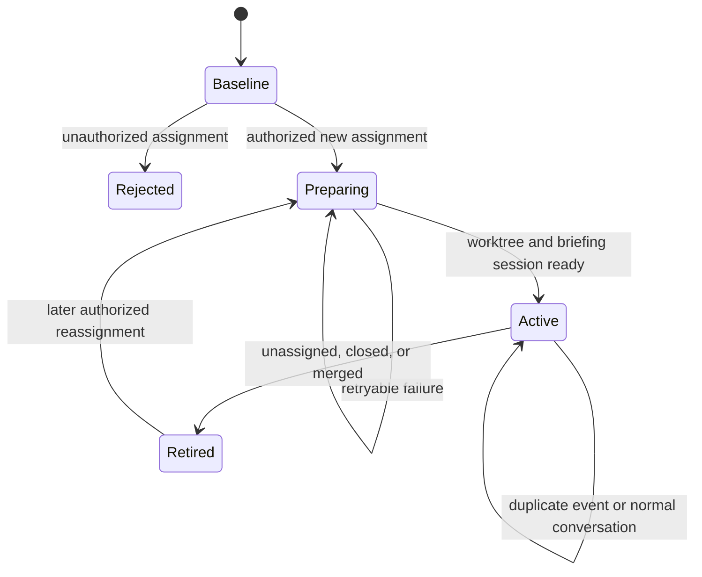

# GitHub Notifications Plan

Status: Notifications MVP 1 is the scope of the current `pirog-notifications`
branch. Its manifest, installation, routing, polling, baseline, trust-admission,
state, worktree, channel-owned session delivery, and one-shot manual refresh command
are implemented. The remaining MVP gate is packed third-party installation proof
in the GitHub Actions-only lifecycle scenario. Notifications 2 is reserved for
the future `pirog-notifications-2` branch.

At the current working-tree snapshot, `bun run lint`, `bun run typecheck`,
`bun run test` (541 passing), `bun run build`, `bun run plugin:check`, and
`bun run test:release` (16 passing) are green. Leia scenarios remain GitHub
Actions-only and have not yet validated the redesigned installed lifecycle.

Phases 0 and 1 now ship the strict manifest schema, static local-only channel,
account-scoped routing projection, private ownership receipt, lifecycle
inspection/reconciliation, typed GitHub monitor, trust admission, private durable
state, at-most-once assignment delivery, trusted managed-worktree preparation,
manual refresh, and deterministic unit coverage for a bounded local-only
briefing session. Session recording and lazy creation use OpenClaw's supported
channel inbound lifecycle; Agent System does not call protected Gateway RPCs.

This document plans an Agent System-owned GitHub work-notification channel. The
2026-08-12 installed scenario exposed an OpenClaw host boundary in the original
privileged session adapter. The redesign removes that adapter and accepts the
narrower host-owned lifecycle: an approved new issue assignment must still
create both the managed worktree and the local issue session, but advanced
inspection, abort, archival, and ambiguous-result reconciliation are deferred.

## Delivery Tracks

### Notifications MVP 1: `pirog-notifications`

The current branch owns only this required product path:

1. A user adds `github.notifications` to an agent manifest. At least one
   immutable `approved-actors` entry is required; the polling interval defaults
   to five minutes.
2. `openclaw agent-system install` reconciles the owned local-only channel
   account and exact agent binding, then the Gateway starts the agent's monitor.
3. The first successful poll records a safe baseline of currently open assigned
   work without creating local work for assignments that already existed.
4. Later polls discover a new GitHub issue assignment to the authenticated
   agent and admit it only when the assignment actor is approved, the canonical
   repository is eligible, and the agent has effective write permission.
5. One admitted assignment creates or reuses exactly one managed worktree and
   one issue-scoped local OpenClaw session. The session receives a bounded
   assignment intake message and remains local-only.
6. The background interval and the explicit one-shot refresh command use the same
   cross-process lease, provider client, baseline, state, admission, and delivery path.

MVP 1 ends when the new assignment has a durable worktree/session correlation.
It does not require later issue or pull-request conversation, completion,
retirement, or cleanup behavior.

### Notifications 2: `pirog-notifications-2`

The follow-up branch owns every lifecycle after initial assignment intake:

- pull-request assignment as a supported product workflow;
- unassignment, reassignment, cancellation, logical retirement, and archival;
- restart and ambiguous-delivery recovery beyond the minimum needed to prevent
  duplicate initial work;
- pull-request correlation, closing-keyword guidance, review routing, and merge
  completion;
- approved GitHub issue and pull-request comments as inbound turns;
- bounded replies and explicit local-update publication back to GitHub;
- replay, retention, status, and explicit worktree/session cleanup controls;
- webhooks, review-request workflows, bots/apps, teams, multiple hosts, and
  additional notification providers.

### Implemented Ahead of MVP 1

The current branch already contains repository logic beyond the narrowed MVP 1.
Keep it unless it materially destabilizes the MVP path, but do not present it as
part of the MVP 1 product contract:

- issue-shaped pull-request assignment discovery and classification;
- canonical unassignment and authority-revocation transitions;
- logical retirement that preserves sessions and worktrees;
- reassignment and multi-stage value-free delivery state;
- bounded no-tools briefing construction;
- optional immutable repository-owner pins.

These capabilities need Notifications 2 acceptance tests before they are called
supported, even when their unit tests already pass in this branch.

### Remaining Work for MVP 1

Prove background polling and manual refresh from a packed third-party installation:
baseline, approved assignment, unauthorized assignment, one worktree, one
session, and no GitHub write.

## Recommendation

Build this as three cooperating pieces rather than one privileged poller:

1. a GitHub assignment monitor discovers assigned work and verifies its actor,
   repository, and agent authority;
2. the existing Git worktree capability prepares the authorized repository work
   area from canonical GitHub metadata;
3. an `agent-system-github` inbound channel routes the accepted event into one
   deterministic OpenClaw session.

Put the per-agent configuration under `github.notifications`, not in a new
top-level section. The feature is GitHub-specific, reuses the existing GitHub
identity and token contract, and does not yet justify a provider-neutral
notification abstraction. If another provider later proves the same lifecycle,
extract common orchestration then rather than designing it speculatively now.

Notifications 2 should form a selective conversational bridge, not mirror two
transcripts. Only a canonical comment from an approved immutable actor that
directly mentions the verified agent is eligible to create an inbound turn.
For a turn that originated from such a comment, the agent produces a separate,
bounded GitHub-facing response draft derived from the local response. That
response is published only when provider authorization and any applicable
narrow GitHub tool policy allow the write and the mandatory secret-safety gate
succeeds. Local-only turns remain local unless an
operator explicitly publishes an update. Tool traces, hidden context, local
paths, failed attempts, and the full OpenClaw transcript are never
synchronization inputs.

## Important Corrections to the Initial Idea

- Do not use GitHub's Notifications REST endpoint as the authoritative event
  stream. Its notification reason can change and then remain sticky, and the
  endpoint does not support fine-grained personal access tokens or GitHub App
  tokens. Use authenticated account-wide assignment search for discovery, then
  targeted assignment events and canonical issue or pull request state for
  admission. The product may still be called notifications.
- Treat pull requests as issue-shaped only for assignment state. GitHub's Issues
  API returns pull requests too, but pull-request review requests are a distinct
  workflow and should be added separately.
- Do not delete a session on unassignment. Retire the work item, stop routing new
  events, and preserve the transcript. OpenClaw or an operator can archive it
  when a supported archive seam is available.
- Do not remove a worktree automatically on unassignment. It may contain useful
  or dirty work. Retain it and make cleanup an explicit operator action through
  the owning Git capability.
- Require an approved actor to start work or send instructions, but honor any
  canonical unassignment of the agent as a revocation. Continuing after the
  assignee was removed is less safe than accepting the possibility of a
  repository-authorized user stopping work.
- A linked issue closes when the pull request is merged into the default branch,
  not merely when the pull request is closed. Use `Closes #<number>` in the pull
  request body and request review from the original assigner when possible.
- Treat a direct agent mention as an addressing signal, not authorization. The
  provider-returned comment author node id must still match an approved actor,
  the comment must belong to the canonical active work item or its linked pull
  request, and the current comment revision must contain an exact standalone
  mention of the verified agent login.
- Do not call the conversational bridge comment synchronization. An admitted
  GitHub comment creates one local turn, and that turn may produce one distinct
  GitHub-facing response. The published response is intentionally less detailed
  than the local transcript and must be rendered from an explicit bounded
  publishable payload rather than by copying or redacting the transcript.

## Installed Runtime Correction (2026-08-12)

The packed third-party plugin scenario disproved the original privileged
session-adapter assumption. OpenClaw exposes `api.runtime.gateway.request` to
bundled or trusted official plugins only. Agent System no longer calls it. The
notification path now resolves the exact channel route, builds the inbound
context, and calls `runChannelInboundEvent`; OpenClaw records or lazily creates
the routed session before dispatching the turn.

This is the supported third-party design for MVP 1. Agent System keeps its
work-item correlation in private monitor state and no longer registers or
patches a session extension. The pre-dispatch `briefing-running` checkpoint
provides at-most-once behavior. If dispatch completion is ambiguous, the monitor
does not retry automatically because the public third-party API cannot inspect
history or active-run state safely.

Do not reintroduce protected Gateway requests, direct session-store edits,
private OpenClaw imports, or spawned Gateway CLI commands. Session inspection,
abort, archival, rich metadata, and safe automated recovery after an ambiguous
result remain Notifications 2 requirements and may need a future public scoped
API. Until then, retirement is logical and preserves the transcript.

Repository guidance requires every optimization pass to inventory OpenClaw SDK
imports and injected runtime calls against the pinned SDK and current official
guidance. `test/openclaw-api-policy.spec.ts` enforces that runtime code does not
call `runtime.gateway.request` or import private OpenClaw implementation modules.

## Policy Alignment After v0.2.3

The v0.2.3 Git and GitHub policy redesign applies narrow manifest controls only
to specific provider-authorization gaps. Notifications follows that model but
keeps its separate admission boundary:

- `approved-actors` and effective repository write access authorize an external
  assignment to create local agent work. They are non-configurable product
  invariants, not tool policy decisions.
- `allowed-repository-owners` is an optional admission allowlist. It narrows
  repository eligibility without authorizing an owner or organization member
  to instruct the agent.
- `github.policy.releases` remains owned by the GitHub tool and is unrelated to
  MVP polling, which performs fixed reads and no GitHub mutation.
- Managed-worktree preparation continues through the Git capability's ordinary
  recognized worktree operation. Notification code does not duplicate Git
  authorization or bypass the owning tool service.
- Future GitHub writes must use the owning scoped capability, honor provider
  token and repository authorization, and apply only any narrow tool policy
  that explicitly selects the requested effect. Risk labels alone do not grant
  or deny the operation.

The pre-v0.2.3 `repository-policy.minimum-permission` field was removed because
it only accepted `write` and incorrectly presented an invariant as configurable
policy. Its optional owner list moved to `allowed-repository-owners`.

## Notifications MVP 1 Outcome

For each configured agent, the Gateway will:

- activate the monitor only after `install` has reconciled the manifest-owned
  channel account and exact agent binding;
- poll GitHub for work assigned to the authenticated agent, with five minutes
  as the default interval;
- let an operator run one immediate intake cycle through
  `openclaw agent-system notifications refresh` without creating a second polling
  or delivery implementation;
- verify the token's GitHub identity on every polling cycle before consuming
  repository data;
- establish a baseline on first activation without starting work for every
  existing assignment;
- detect a new issue assignment to the authenticated agent;
- prove that the assignment event came from an approved immutable GitHub actor;
- require the agent to have at least write permission on the canonical
  repository and optionally constrain repository owners by immutable id;
- derive the worktree repository id, clone URL, and base ref from canonical
  GitHub metadata rather than a per-repository manifest entry;
- prepare one deterministic managed worktree;
- create or reuse one deterministic issue-scoped OpenClaw session;
- deliver one bounded, local-only assignment intake message so the session is
  ready for an operator or agent to continue;
- preserve the work item's repository, issue, assignment, worktree, and session
  correlation in private durable state.

The assignment intake is the end of autonomous MVP 1 behavior. It may contain
bounded issue metadata, but it must not edit code, comment on GitHub, push, open
a pull request, or complete a second agent turn. The operator or agent continues
the work in the created session under normal Agent System tool policy.

## Notifications MVP 1 Non-goals

- GitHub webhooks or GitHub App installation management
- per-repository manifest enumeration
- treating organization membership alone as repository authorization
- pull-request assignments as a supported workflow, even though the current
  discovery code already classifies them
- unassignment, reassignment, retirement, archival, and cleanup guarantees
- automatic ingestion of arbitrary issue bodies or comments as instructions
- review-request, mention, team, project, discussion, or workflow notifications
- automatic issue, branch, commit, push, or pull request creation
- automatic mirroring of every local assistant response to GitHub
- destructive session or worktree cleanup
- multiple GitHub hosts
- a generic cross-provider notifications framework

## Notifications 2 Feature-complete Outcome

For this plan, feature complete means the GitHub notifications channel supports
the full assignment-driven conversation lifecycle on `github.com`, not every
event or integration GitHub can provide. After Phases 0 through 6, it will:

- discover and safely admit approved assignments;
- prepare or reuse one deterministic managed worktree and OpenClaw session;
- keep the issue, linked pull request, worktree, and session correlated through
  completion and retirement;
- accept new or materially edited issue, pull-request conversation, and linked
  review comments only when the canonical human author is approved and the
  current comment revision contains an exact standalone
  `@<verified-github-login>` mention in author-written prose;
- route each admitted comment to the existing local session with immutable
  provenance and bounded untrusted content;
- produce at most one bounded, conversational GitHub-facing response for that
  GitHub-originated turn, subject to provider authorization, any applicable
  narrow tool policy, and the mandatory secret-safety gate;
- support an explicit publish action for selected local updates without making
  the whole local transcript remotely visible;
- suppress self-events and duplicate delivery across retries, edits, restarts,
  and ambiguous provider-write outcomes;
- expose sufficient status, replay, retirement, and explicit cleanup controls
  to operate and recover the channel safely; and
- prove the complete lifecycle in deterministic tests and the installed
  GitHub Actions-only scenario.

Signed webhooks or GitHub App installation management, team or app actors,
review-request workflows, multiple GitHub hosts, repository-specific actor
sets, and additional notification providers are later expansions. Polling can
deliver the complete behavior above; webhooks improve latency and scale but do
not change its semantic contract.

## Proposed Manifest Shape

The exact schema is a Phase 0 deliverable. The intended public shape is:

```yaml
schema-version: 1

agent:
  id: tanaabot
  name: Tanaabot

environment:
  required:
    - GH_TOKEN_TANAABOT

git:
  worktrees: {}

github:
  host: github.com
  username: tanaabot
  token: GH_TOKEN_TANAABOT
  notifications:
    interval-minutes: 5
    approved-actors:
      - login: pirog
        node-id: U_kgDOB9x7Qw
    allowed-repository-owners:
      - login: tanaabased
        node-id: O_kgDOB7x6Qw
```

Configuration rules:

- The presence of `github.notifications` enables the monitor for that agent.
- `interval-minutes` defaults to `5`, has a minimum of `1`, and is still subject
  to provider rate-limit and backoff instructions.
- At least one `approved-actors` entry is required.
- Actor authorization uses the opaque `node-id`; `login` is required for human
  review and drift diagnostics but is not the authorization key.
- Effective `write`, `maintain`, or `admin` access is required. This is an
  admission invariant because assignment intake creates local work and should
  only start for a repository where the agent can complete the ordinary branch
  and pull-request workflow.
- `allowed-repository-owners` is optional. When present, the repository owner's opaque
  user or organization node id must match. When absent, any repository is
  eligible if the verified agent has write permission and the assignment actor
  is approved.
- `allowed-repository-owners` restricts repository ownership; it does not authorize every
  member of an allowed organization to instruct the agent. Assignment and
  comment authority remains the exact `approved-actors` user-id set. If that
  list later becomes burdensome, add approved GitHub teams with explicit member
  lookup rather than trusting an entire organization by default.
- Agent organization membership is not an admission shortcut. Membership does
  not imply access to every organization repository, excludes valid outside
  collaborators, and can require additional organization-member scopes. The
  effective repository permission is both more direct and easier to revoke.
- The provider response, never the event or model, supplies the canonical
  repository node/database id, owner identity, supported clone URL, and default
  branch. Agent System derives a stable internal repository id such as
  `github-<database-id>` and an `origin/<default-branch>` base ref.
- The event and model cannot supply a clone URL, base ref, local path,
  executable, repository id, or agent id.
- The authenticated agent's GitHub node id is resolved from `/user` at poll
  time. Assignment targets must match that verified identity, not only a login
  string from the event.
- GitHub App and bot actors are denied in MVP 1. A later schema can add
  explicitly pinned app identities if a real use case requires them.

MVP 1 has no cleanup options. Existing logical-retirement behavior is retained
as implemented-ahead code, but its product contract and cleanup controls belong
to Notifications 2.

## Manual Refresh Command (Notifications MVP 1)

Add one explicit command for CI, diagnosis, and operators who do not want to
wait for the next configured interval:

```text
openclaw agent-system notifications refresh [--agent <id>] [--json]
```

The command contract is:

- without `--agent`, discover the manifest from the current workspace; with
  `--agent`, resolve that agent's installed manifest using the normal binding;
- require enabled `github.notifications` configuration and the exact installed
  channel account/binding rather than creating or repairing configuration;
- use the same provider client, baseline, state store, trust admission,
  worktree/session delivery coordinator, and per-agent lock as the background
  monitor;
- if another process owns the agent's cycle, wait up to two minutes for the
  private lease before returning a stable busy result rather than overlapping it;
- bypass only the normal interval deadline, while continuing to honor provider
  rate-limit instructions, active backoff, cancellation, and every trust gate;
- establish the ordinary safe baseline on first use and never treat a manual
  poll as implicit replay of assignments that predate that baseline;
- return success for a completed baseline or a poll with no new work, and return
  a nonzero exit code for invalid configuration, routing drift, authentication,
  provider, state, or delivery failure;
- keep human output concise and make `--json` report value-free stable codes,
  baseline, approved, rejected, duplicate, and retired counts without tokens or
  untrusted issue content.

This is a trigger for one normal polling cycle, not a separate message-fetching
queue and not a raw GitHub API passthrough.

## Manifest-to-OpenClaw Reconciliation

The workspace manifest remains the source of desired per-agent behavior, but a
channel cannot be entirely workspace-local. OpenClaw routes inbound messages
through global channel accounts and `bindings`, so Agent System must project a
small, non-secret routing record into the active OpenClaw configuration.

For an agent named `tanaabot`, the intended global projection is semantically:

```json5
{
  channels: {
    'agent-system-github': {
      accounts: {
        tanaabot: { enabled: true },
      },
    },
  },
  bindings: [
    {
      agentId: 'tanaabot',
      match: {
        channel: 'agent-system-github',
        accountId: 'tanaabot',
      },
    },
  ],
}
```

The channel account id equals the normalized Agent System agent id. Each work
item is a distinct channel conversation beneath that account. The account-level
binding therefore selects the correct agent and workspace, while the work-item
conversation id selects the deterministic session.

This global projection contains only activation and routing facts. Keep the
GitHub token binding, poll interval, approved actors, repository-owner allowlist,
work state, and GitHub content in the owning workspace manifest or private
Agent System state. Never duplicate those values under `channels.*`.

Lifecycle ownership:

- `validate` checks the manifest projection without reading or mutating global
  OpenClaw state.
- `doctor` reads the manifest, global channel account, routing bindings, and an
  Agent System ownership receipt. It reports missing, duplicate, conflicting,
  or stale projections without repairing them.
- `install` is the only Agent System command that creates or repairs the channel
  account and exact account-scoped binding. It runs after agent registration,
  re-reads the config, and verifies that OpenClaw resolves this channel account
  to the same agent and workspace.
- Removing `github.notifications` makes the desired state disabled. A later
  `install` removes only the exact channel account and binding recorded in the
  private ownership receipt. If either target was changed or is now owned by
  another agent, installation stops with a conflict instead of replacing it.
- The runtime monitor stays stopped unless the loaded manifest, channel account,
  account-scoped binding, agent id, and workspace all agree. OpenClaw's fallback
  to the default agent must never activate this channel.

The pinned SDK exposes a supported transactional `mutateConfigFile` boundary
with explicit reload intent. Phase 0 therefore creates or removes the
activation-only account and exact binding in one focused source-config mutation
with `afterWrite: auto`, then verifies the resolved route before writing or
removing the private receipt. The mutation preserves unrelated channel accounts
and bindings and avoids editing `openclaw.json` directly or leaving a
multi-command half-install behind.

OpenClaw hot-applies `bindings`. Updating an existing `channels.*` account can
restart only the affected channel, while creating or removing the top-level
channel configuration can require a full Gateway restart. The owning GitHub
Actions-only Leia scenario runs the Gateway with in-process restarts enabled,
then verifies runtime config convergence and cleanup without losing process
tracking. If reload watching is disabled, installation should report that a
manual Gateway restart is still required. The implemented binding also sets
`dmScope: per-account-channel-peer`, so each stable GitHub work-item conversation
becomes a distinct session. Repository validation never mutates the developer's
live Gateway.

## Trust and Prompt-Injection Model

An approved GitHub identity is necessary but not sufficient to make every byte
of a GitHub object a trusted instruction.

### Trusted control facts

- configured agent id and workspace
- verified GitHub account node id and login
- verified global channel account and account-scoped agent binding
- canonical repository and owner ids, effective agent permission, supported
  clone URL, and default branch returned by GitHub
- assignment or unassignment event id, actor node id, assignee node id, and
  timestamp returned by GitHub
- canonical comment node id, author node id, repository and item association,
  revision timestamp, and URL returned by GitHub
- worktree result returned by the existing Agent System service
- deterministic session and work-item ids generated locally

### Untrusted content

- issue and pull request titles and bodies
- comments, quoted text, links, patches, filenames, and repository contents
- labels and milestone descriptions
- any text supplied by a GitHub actor, including an approved actor quoting
  someone else

Authorization must complete using only trusted control facts. Untrusted content
is fetched only after admission and is placed in a bounded, explicitly labelled
data block. The automated briefing turn should receive no mutating tools. It may
summarize the data and propose an approach, but it cannot turn pasted issue text
into a side effect.

Comment admission additionally requires the current canonical comment body to
contain an exact standalone `@<verified-github-login>` mention in author-written
prose. The verified login comes from `github.username` after it matches the
authenticated `/user` response; `@agent` is not a literal product keyword.
The login comparison follows GitHub's case-insensitive username semantics while
still requiring one complete standalone mention token.
Mention detection is a routing condition over untrusted content, not an
authorization boundary. Mentions inside quoted text, code blocks, inline code,
or hidden markup do not address the agent.

Subsequent interactive turns use the owning Agent System tools. Their narrow
policies apply only when an operation selects a protected effect, while the
GitHub token's repository permissions remain the final remote authorization
boundary.

## Event Admission

An assignment is accepted only when all of these are true:

1. the monitor has an exact account-scoped OpenClaw binding from
   `agent-system-github:<agent-id>` to the loaded manifest's agent and workspace;
2. the GitHub token resolves and `/user` matches `github.username`;
3. GitHub's canonical repository response is active and its owner satisfies any
   configured `allowed-repository-owners` constraint;
4. GitHub reports that the verified agent has effective `write`, `maintain`, or
   `admin` repository access;
5. the item is currently assigned to the verified GitHub agent identity;
6. a new `assigned` event targets that identity;
7. the assigner's opaque node id matches `approved-actors`;
8. the event is newer than the initial baseline and has not been processed;
9. the work item is not already active through an issue-to-pull-request
   correlation.

An unassignment is acted on when the canonical item state no longer contains
the agent or a new `unassigned` event targets it. The actor is recorded, but
revocation does not require an approved actor.

Events authored by the agent itself and outbound records already written by
Agent System are ignored to prevent feedback loops.

### Comment Admission

A comment creates an agent turn only when all of these are true:

1. the work item is active and already has the exact routed session;
2. the comment belongs to the canonical issue, pull-request conversation, or a
   pull request already correlated to that work item;
3. GitHub's canonical response identifies a human author whose opaque node id
   matches `approved-actors` and is not the authenticated agent;
4. the current canonical body contains an exact standalone mention of
   `@<verified-github-login>` in author-written prose;
5. the comment node id and current revision have not already been delivered;
6. the comment is not an outbound comment previously written by Agent System;
   and
7. the item has not been retired, closed, transferred, or otherwise lost its
   admission authority.

An edit is eligible for one new turn only when its canonical revision changes
materially and the current body still satisfies the mention rule. Adding the
mention may make a previously ignored comment eligible; removing it before
delivery makes the comment ineligible. Deletion never creates an instruction.
Pull-request review requests and reviews without an addressed comment remain a
separate future workflow.

## Polling and State

Use an authenticated account-wide issue and pull-request search for discovery,
with a bounded overlap on `updated` time and `assignee:<verified-login>`. Search
results are candidates, not authority. For each new candidate, fetch the
canonical repository, effective agent permission, item state, and targeted
assignment events before admission. Recheck every active work item directly so
an unassignment is detected even though the item disappears from the assignee
search result.

The GitHub Notifications REST endpoint may be an optional discovery accelerator
for compatible credentials, but it is never required and never authorizes a
transition. Detect and diagnose search-result truncation rather than silently
skipping work. Do not pass arbitrary URLs, search strings, or GraphQL documents
from the manifest or model. Keep the provider client typed and
transport-neutral; an initial implementation may reuse the existing fixed `gh
api` child environment, while allowing a later direct HTTP transport without
changing the workflow contract.

Each agent gets private durable state beneath the plugin state directory. Store
only non-secret facts:

- repository identity, verified permission, and poll high-water mark
- conditional-request metadata when supported
- processed event node ids
- processed comment node ids and revision timestamps
- active and retired work-item records
- assigner, assignee, worktree, branch, session, and linked pull request ids
- outbound comment node ids and locally generated operation ids used only for
  retry reconciliation and loop suppression
- last successful poll, current backoff, and stable diagnostic code

Do not persist tokens, issue bodies, comment bodies, model prompts, or command
output in the monitor state.

Polling behavior:

- no overlapping poll for the same agent;
- bounded concurrency across discovered and active work items;
- a small search overlap window plus event-id deduplication to avoid cursor
  gaps;
- jitter around the configured interval;
- exponential backoff for transient failures;
- honor GitHub rate-limit and retry headers;
- stop through an `AbortSignal` when the Gateway or plugin service stops;
- make every transition idempotent so restart and retry cannot duplicate a
  worktree, session, briefing, or GitHub write.

On first enablement, record the current assigned-item snapshot and search
boundary without creating sessions. A future explicit replay command may opt
into older assignments, but replay is not implicit.

## Work-item Identity and Lifecycle

Use the stable work-item key:

```text
github:<repository-node-id>:<issue-number>
```

GitHub pull requests also have issue numbers, so the repository node id and
number are sufficient. Store the item type separately.

Derive a human work id from trusted and sanitized metadata:

```text
gh-<owner>-<repo>-<number>-<title-slug>
```

Pass that work id to the existing worktree service and use the returned branch
and path as authoritative. Pass the internally derived
`github-<repository-database-id>`, provider-selected canonical clone URL, and
`origin/<default-branch>` rather than requiring a manifest repository entry. Do
not predict the worktree service's digest or reimplement its naming rules.



Persist the transition before and after each external side effect. Worktree
preparation and session routing use deterministic ids, so recovery can inspect
and resume rather than blindly repeat.

## Session and Channel Behavior

Register a static channel id such as `agent-system-github`; do not claim the
generic `github` channel id. The plugin already owns multiple capabilities, so
keep the root `index.ts` entry and register the channel explicitly rather than
turning the whole package into a channel-only entrypoint.

Map one GitHub work item to one stable channel conversation id. The channel
inbound pipeline should create or reuse the corresponding agent session and
record origin metadata. The inbound route uses the manifest agent id as its
channel account id; delivery fails closed if the exact global account binding is
missing or selects another agent. The initial inbound event contains:

- repository, item type, number, title, URL, labels, and milestone summary;
- assigner identity and assignment time;
- returned worktree path and branch;
- an explicit statement that GitHub content is untrusted project data;
- a request to summarize the issue, its surrounding context, likely approach,
  risks, and open questions.

The automated briefing is local-only. A no-op or suppressed outbound adapter
must not post its answer to GitHub. The response remains visible in the OpenClaw
session transcript.

After the initial briefing, an admitted GitHub comment creates one turn in that
same session. Its prompt contains immutable provenance, the exact source URL,
and a bounded untrusted-content block. The local response may be as detailed as
normal work requires. For a GitHub-originated turn, the workflow separately
constructs a bounded GitHub-facing response containing only an appropriate
conversational update, decision, question, or next step. It must not derive that
response from tool traces or the wider transcript, and redaction alone is not a
sufficient publication boundary.

The GitHub-facing response is published only when provider authorization and any
applicable narrow tool policy allow the write. If publication is denied or
fails, the local response and a recoverable
unpublished status remain in the session. A local operator turn is never
published automatically; it requires the explicit publish action. Every
successful write records the exact published text and provider comment id in
the local session and records the provider id in private state for loop
suppression.

### GitHub-facing Secret Safety

A GitHub-facing response must never contain a secret or secret-bearing private
information. This is a fail-closed publication invariant, not a best-effort
prompt instruction.

- Construct the remote response from a separate, bounded publishable payload
  with explicit fields. Never pass the full transcript, tool trace, environment,
  command output, or arbitrary local files into a sanitizer for publication.
- Exclude content with secret provenance, including resolved environment values,
  access tokens, authorization headers, private or signing keys, credential
  references paired with values, signed URLs, cookies, and tool output marked
  sensitive.
- Run deterministic secret detection and sanitization before showing the exact
  preview for authorization or an explicit publish action. Cover common
  token, key, credential, and
  high-entropy secret forms, and replace detected material with a stable safe
  placeholder.
- Resolve the GitHub credential only after provider and Agent System authorization allow the write. Immediately
  before the provider write, check the exact UTF-8 bytes again, including against
  sensitive values already held by that explicit consumer. Never resolve
  unrelated secrets merely to expand the scan.
- If the final check detects secret material, sensitive provenance is unclear,
  the content changed after authorization, or the sanitizer cannot complete, abort
  publication. Regenerate and preview a safe response rather than silently
  sending altered text.
- Never log, diagnose, persist in monitor state, or include in authorization metadata
  the detected secret, its source value, or the rejected unsanitized payload.

Tests use synthetic canary secrets to prove that known token and key forms,
values already held by the writer, and secret-derived content cannot reach the
provider adapter, logs, diagnostics, authorization records, or durable control state.

The pinned SDK exposes the channel inbound routing, session-recording, and
long-lived plugin-service surfaces required by MVP 1. The broader Gateway
request helper remains restricted to bundled or trusted official plugins and is
not used. Native `spawnedCwd` and `spawnedWorkspaceDir` fields are restricted to
`subagent:*` and `acp:*` lineage, so an ordinary routed channel session uses this
fallback:

- keep worktree and issue correlation in private Agent System monitor state;
- include the returned branch and worktree path in bounded inbound context and
  the assignment briefing;
- pass explicit tool `cwd` values pointing at the managed worktree on later
  Agent System tool calls; and
- record logical retirement without deleting the OpenClaw transcript.

Do not schedule an immediate assignment through `scheduleSessionTurn` or bypass
the channel kernel with `sessions.send`. The accepted inbound event starts one
assembled channel turn directly so the runtime can enforce a per-turn no-tools
policy. Durable transition claims and reconciliation own duplicate prevention.

## Pull-request Completion Contract

The assignment workflow does not automatically open a pull request. Once the
operator and agent finish the work in the session, the existing Git and GitHub
tools remain the execution surface.

Session guidance should require:

- a pull request body containing `Closes #<issue-number>` when the pull request
  targets the repository's default branch;
- the stored original assigner requested as a reviewer when that user is
  eligible, rather than merely assigning the pull request to them;
- the linked pull request id persisted on the existing work item so the agent's
  own pull request does not create a duplicate session;
- provider authorization and any applicable narrow GitHub tool policy for every mutation;
- no claim that a closed-but-unmerged pull request closes the issue.

## Phased Implementation by Delivery Track

### Phase 0: Platform Contract Spike (routing foundation implemented)

Goal: prove the design against the supported OpenClaw SDK before adding remote
polling.

- Update or confirm the pinned OpenClaw compatibility version before using any
  newer channel API.
- Register an inert `agent-system-github` channel in discovery and full modes.
- Exercise a synthetic assignment through the current channel inbound helper in
  a unit test and prove deterministic route selection.
- Before Phase 2 enables assignment delivery, prove a local-only reply appears
  in the installed OpenClaw session without an outbound GitHub side effect.
- Before Phase 2, determine whether the current host supports a session label
  and per-session cwd. Record the fallback contract if it does not.
- Before Phase 2, determine the supported retirement/archive seam. Keep logical
  retirement if native archive is unavailable.
- Finalize an activation-only multi-account channel schema whose account id is
  the Agent System agent id.
- Add a notifications lifecycle contribution that always participates so
  `validate`, `doctor`, and `install` can detect both enabled state and removal.
- Prove supported creation and removal of the global channel account plus exact
  account-scoped binding without duplicating secrets or notification policy
  under `channels.*`.
- Record a private ownership receipt, reject a binding owned by another agent,
  preserve unrelated accounts and bindings, and verify the post-install route.
- Prove binding hot reload and channel configuration convergence, including a
  full in-process Gateway restart when the top-level channel appears or leaves.
  Report the manual-restart case when reload is disabled.
- Finalize the strict `github.notifications` schema and static plugin manifest
  channel metadata.

Implemented proof includes channel registration, strict schema normalization,
install/doctor reconciliation, idempotency, unrelated-state preservation,
inbound-kernel route selection and session recording tests, explicit rejection
of default or mismatched routing, and receipt-backed cleanup. Native session
title, cwd, abort, and archive behavior are Notifications 2 concerns. The Leia
scenario is the operational configuration and installed-delivery proof and
remains GitHub Actions-only.

### Phase 1: Monitor, Trust Core, and Manual Trigger (implemented)

Goal: discover and classify events without creating sessions or worktrees.

- Add manifest parsing and normalization for `github.notifications`.
- Add a typed GitHub work-event client with fixed endpoints and bounded output.
- Verify the authenticated agent's login and node id per polling cycle.
- Add account-wide assigned-item discovery, baseline, overlap, pagination-limit
  diagnostics, dedupe, backoff, and rate-limit handling.
- Fetch canonical repository identity, owner, clone/default-branch metadata, and
  effective agent permission before fetching untrusted issue content.
- Recheck active items directly for unassignment, permission loss, archival,
  transfer, or deletion.
- Add immutable actor admission and self-event suppression.
- Add a private atomic state store with symlink and permission checks.
- Register one long-lived Gateway plugin service with clean abort/stop behavior.
- Add the MVP 1 `notifications refresh` command as a one-shot trigger over that
  same monitor cycle, state, and per-agent serialization boundary.
- Report value-free status through logs and `doctor`; add a read-only
  `notifications status` CLI only if it materially improves diagnosis.
- Run in observe-only mode in the owning Leia scenario.

MVP 1 exit criteria: approved, rejected, duplicate, first-baseline,
repository-permission, owner-allowlist, search-truncation, pagination,
manual/background parity, and transient-failure cases are deterministic under
fake GitHub responses and no local work is created during this observe-only
phase. Existing unassignment and restart-recovery coverage is retained for
Notifications 2.

### Phase 2: Assignment to Worktree and Briefing Session

Goal: complete the core MVP user experience.

#### Phase 2A: Prove the Installed Session Contract (redesigned; repository proof implemented)

- Use the supported channel inbound lifecycle rather than a separate session
  adapter or direct session-store access.
- For MVP 1, prove that the channel kernel records or creates the exact
  deterministic routed session while retaining the channel conversation label.
- Prove that the channel inbound kernel can record the GitHub provenance and
  deliver one immediate local assignment intake with a stable provider event
  id. Do not use a scheduled turn for immediate assignment delivery.
- Prove that the assignment intake is visible in the OpenClaw transcript while
  the channel still has no GitHub outbound adapter. A completed automated
  briefing response is implemented-ahead behavior, not an MVP 1 requirement.
- Keep worktree correlation in private monitor state and include its path in the
  bounded inbound context and briefing. Use logical retirement because native
  abort and archive support are Notifications 2 requirements.

The implementation now has no dependency on generic `runtime.gateway.request`.
The assembled inbound contract carries `createIfMissing: true`,
`disableTools: true`, and an empty per-turn `toolsAllow`; the synthetic channel
has no outbound adapter. A packed installed scenario must still prove one
recorded local session from the third-party package.

#### Phase 2B: Expose Trusted Worktree Preparation (implemented)

- Factor one narrow internal worktree-preparation service out of the existing
  Git capability assembly and share the same `GitWorktreeService`, layout,
  runner, identity, SSH resource, and cleanup implementation as the native tool.
- Keep the service owned by `tools/git/`, and inject it into a root `lib/`
  assignment orchestrator because that workflow coordinates a channel and a
  tool capability.
- Do not invoke `agent_system_git_worktree`, synthesize a model tool call, shell
  through the CLI surface, or expose a generic policy bypass.
- Treat the admitted assignment as authority only for the ordinary
  `git.worktree.prepare` write operation. Apply Git authorization before
  resolving environment values or acquiring SSH material.
- Accept only the internally derived `github-<repository-database-id>`, a work
  id persisted on first admission, the provider-verified clone URL, and
  `origin/<default-branch>`. Never accept a model- or event-supplied local path,
  repository id, clone URL, or base ref.
- Return the existing service's canonical branch and path and dispose every
  invocation-scoped Git or SSH resource on success, failure, or cancellation.

#### Phase 2C: Add an At-most-once Assignment State Machine (implemented)

- Extend the private monitor state with a versioned, value-free delivery record
  containing the stable work id, assignment event id, workflow stage, worktree
  branch and path, routed session key and id when available, briefing
  idempotency key, and stable failure code. Do not persist GitHub bodies, prompts,
  transcript content, command output, environment values, or credentials.
- Migrate valid Phase 1 state explicitly or establish a diagnosed safe baseline;
  never reinterpret an older record silently.
- Have the pure poller return typed admitted and retirement transitions instead
  of only aggregate counts. Keep remote discovery and trust admission separate
  from side-effect execution.
- Serialize one work item transition at a time per agent and persist checkpoints
  around worktree preparation and briefing dispatch: admitted, worktree-ready,
  briefing-running, active, and retired. Retain `session-ready` only as a legacy
  state that advances into channel dispatch.
- On restart, reconcile the deterministic worktree before dispatch. Treat a
  persisted `briefing-running` stage as ambiguous and require operator
  inspection rather than retrying without a public session-history seam.

#### Phase 2D: Deliver the Bounded Briefing (implemented; installed proof pending)

- After admission, fetch a separate bounded canonical briefing projection with
  the title, URL, body excerpt, labels, and milestone summary. Keep all textual
  GitHub content explicitly marked as untrusted and do not persist it in monitor
  state.
- Build the deterministic conversation id from the repository node id and item
  number, then let OpenClaw's inbound kernel record or create that routed
  session.
- Include the issue, repository, assignment, branch, and canonical worktree path
  in private monitor state and the bounded inbound context. Pass the path
  explicitly as cwd to later Agent System tools; do not attempt the host's
  subagent-only cwd fields.
- Claim the assignment event durably before running it through
  `runGitHubNotificationAssignment` as an assembled inbound turn. Carry the
  stable provider event id into the channel context and never retry a persisted
  ambiguous claim automatically.
- Enforce a no-tools automated briefing turn at the runtime boundary with both
  `disableTools: true` and an empty per-turn `toolsAllow`. Do not rely on prompt
  wording or a session-level restriction that the host normalizes away.
- Keep channel outbound delivery unavailable. The briefing response stays local
  and Phase 2 performs no GitHub mutation.
- Mark the item active only after the channel kernel reports a dispatch for the
  expected routed session. A timeout or ambiguous response remains claimed and
  never creates another briefing speculatively.

Implemented repository behavior reuses the Phase 2C orchestrator and optimized
private state codec. The monitor reconciles persisted worktree transitions
before a normal poll is due, while honoring failure backoff, and introduces no
second delivery queue or state store. It rechecks canonical GitHub authority,
uses only the trusted managed-worktree service, and dispatches through the
public channel inbound kernel. Installed proof still requires the packed
scenario to record exactly one local-only no-tools briefing.

#### Phase 2E: Retirement and Failure Recovery (Notifications 2; logical retirement implemented)

- Recheck assignment, repository, permission, and route authority immediately
  before each side effect, not only at the beginning of the polling cycle.
- If authority is revoked before worktree creation, retire without creating
  local work. If revoked later, record logical retirement, stop new turns, and
  preserve the worktree and transcript.
- Archive the session only through the proven host seam; otherwise record
  logical retirement. Never delete the session or automatically remove the
  worktree.
- Notifications 2 may add a scoped abort/archive seam and safe session-history
  reconciliation. Until then, an ambiguous briefing remains claimed and reports
  a stable value-free diagnostic without automatic retry.

#### Phase 2F: MVP 1 Proof and Documentation (repository work implemented; remote proof pending)

Repository unit coverage, the manual refresh command, and the installed assignment
scenario are implemented. The scenario has been updated for the channel-owned
session contract and must pass in GitHub Actions before the installed exit
criteria are met.

- Add focused unit tests for the trusted worktree adapter, transition planner,
  orchestrator, inbound session service, bounded briefing builder, tool restriction,
  cancellation, migration, and every partial-failure restart boundary.
- Prove that rejected, duplicate, mismatched-route, disallowed-owner,
  insufficient-permission, and revoked assignments create neither a worktree nor
  a session.
- Extend the existing GitHub Actions-only notifications scenario to prove one
  approved issue assignment creates one managed worktree and one local session,
  the manual refresh uses the same path as the background monitor, an unauthorized
  assignment creates neither resource, and no GitHub write occurs.
- Update channel and Git worktree documentation only for behavior that is
  implemented, and record the delivered phase in the changelog at release time.

Exit criteria: a new approved issue assignment creates exactly one worktree and
one local session from either polling entrypoint; an unauthorized assignment
creates neither; first use establishes a baseline; and the installed package
performs no GitHub mutation. Retirement, reassignment, and broader lifecycle
recovery are Notifications 2 exit criteria.

### Phase 3: Completion and Pull-request Correlation (Notifications 2)

Goal: keep one work item coherent through normal agent-led implementation.

- Add session guidance and metadata for the issue number, worktree, original
  assigner, and expected pull request linkage.
- Detect a pull request linked to the issue and correlate it to the existing
  work item rather than opening a second session.
- Ensure generated pull request guidance uses a closing keyword only for the
  default-branch completion path.
- Request review from the original assigner when eligible and authorized by the
  provider and any applicable narrow GitHub tool policy.
- Retire completed work on merge or issue closure while retaining transcript
  and worktree until explicit cleanup.

Exit criteria: one issue remains one session across assignment, work, pull
request, review, and merge, with no self-notification loop.

MVP 1 ends at Phase 2F. Phase 3 begins the Notifications 2 product lifecycle.

### Phase 4: Approved GitHub Comments Inbound (Notifications 2)

Goal: let authorized collaborators continue the active discussion from GitHub.

- Poll issue and pull-request conversation comments only for active configured
  work items, plus review comments on an already correlated pull request.
- Require an exact approved actor node id and reject bot/app actors by default.
- Require an exact standalone `@<verified-github-login>` mention in the current
  canonical comment body. The verified login is the configured
  `github.username` after `/user` identity verification; the rule never matches
  a literal generic `@agent` token. Ignore mentions found only in quoted text,
  code, or hidden markup. Do not make every collaborator comment an instruction.
- Deduplicate by comment node id and track edits as revisions rather than
  replaying the original instruction.
- Route the accepted comment to the existing issue session with structured
  provenance and bounded content.
- Ignore comments authored by the agent or previously written by Agent System.
- Continue to apply provider authorization and applicable narrow tool policy.

Exit criteria: an approved comment that directly mentions the verified GitHub
user reaches exactly one active session; unapproved, unmentioned,
quoted-mention-only, edited-duplicate, retired-item, and self comments produce
no agent turn.

### Phase 5: Conversational Replies Back to GitHub (Notifications 2)

Goal: carry the useful part of the discussion back to GitHub without mirroring
the local conversation.

- For a turn created by an admitted GitHub comment, construct at most one
  separate GitHub-facing response from an explicit bounded publishable payload.
- Expose a scoped comment-write service to the trusted workflow orchestrator;
  do not shell through or impersonate the model-facing GitHub tool, and preserve
  provider authorization, applicable narrow policy, and credential timing.
- Keep the GitHub response conversational and useful, but omit private context,
  tool traces, local paths, hidden instructions, raw failures, credentials, and
  unrelated transcript history. Do not treat after-the-fact redaction of the
  full transcript as the security boundary.
- Pass the separately constructed response through the mandatory GitHub-facing
  secret-safety pipeline before preview and again on the exact bytes immediately
  before send. Any secret hit, uncertain provenance, or post-authorization change
  blocks publication and exposes only a value-free local diagnostic.
- Add an explicit semantic publish action for operator-originated local updates;
  no other local turn is automatically eligible for publication.
- Show the exact bounded comment content and target before an explicit publish
  action, apply provider authorization and any applicable narrow GitHub tool
  policy, and resolve credentials only afterward.
- Post a new issue or pull-request comment rather than mutating local history,
  store its node id, and render the exact published text and URL in the local
  session.
- Mark outbound comments for loop suppression using stored provider ids; a
  hidden operation marker may support ambiguous-write recovery but must never
  be the trust boundary or visible source of authority.
- When an outbound write has an ambiguous result, reconcile by the local
  operation id before retrying so recovery cannot post duplicates.

Exit criteria: each admitted GitHub comment can yield at most one authorization-checked
GitHub-facing response; selected local updates require explicit publication;
the exact remote text remains visible locally; retries do not duplicate it; and
its resulting notification is never ingested as a new turn.

### Phase 6: Operational Completion and Recovery (Notifications 2)

Goal: close the operational gaps required for a feature-complete channel.

- Add value-free status and diagnostics for assignment, comment, session,
  worktree, outbound publication, retry, and retirement state.
- Add explicit bounded replay for missed assignments or comments without
  changing the safe first-run baseline.
- Add explicit cleanup for retired routing state and worktrees through the owning capabilities,
  refusing dirty worktrees by default; archive sessions through a supported
  seam when available and otherwise preserve their transcripts.
- Reconcile uncertain worktree, session, and outbound-comment side effects
  before retrying.
- Bound comment pagination and revision history, detect truncation, and recover
  without silently skipping addressed comments.
- Complete documentation, migration notes, and installed GitHub Actions-only
  coverage for the assignment, comment, reply, restart, retirement, replay, and
  cleanup lifecycle.

Exit criteria: an operator can diagnose, replay, retire, and explicitly clean
up the channel; crash recovery is idempotent across every side effect; and the
complete assignment-to-conversation lifecycle passes unit, package, and
installed-runtime validation.

Phases 0 through 6 are the feature-complete GitHub notifications channel.

## Post-feature Expansions

Consider only after the polling channel is stable:

- signed GitHub webhooks or a GitHub App for lower latency and higher scale;
- review-request events as a distinct pull-request-review workflow;
- approved GitHub App actors;
- approved GitHub teams as a narrower scalable actor policy than trusting every
  member of an organization;
- repository-specific actor sets;
- richer issue hierarchy, project, dependency, and milestone context;
- additional providers after extracting a proven common notification core.

## Testing Strategy

### Unit and integration tests

- strict manifest schema, kebab-case keys, normalization, and unknown-key
  rejection;
- global account and binding planning, conflict detection, ownership receipts,
  idempotent install/removal, and post-install route verification;
- token identity, agent assignee identity, repository permission, owner policy,
  and actor gates;
- issue versus pull request classification;
- account-wide search baseline, overlapping windows, truncation, pagination,
  event ordering, dedupe, and restart recovery;
- assignment, reassignment, unassignment, closure, merge, and self-event state
  transitions;
- private state permissions, atomic replacement, malformed state, and symlink
  rejection;
- bounded prompt construction and trusted/untrusted provenance separation;
- deterministic work ids without reimplementing worktree naming;
- partial failures around worktree creation and inbound turn dispatch;
- approved-author and exact verified-login mention admission for issue,
  pull-request conversation, and linked review comments;
- mentions in quotes, code, hidden markup, stale revisions, retired items, and
  self-authored comments produce no turn;
- bounded local-only briefing delivery, separate GitHub-facing response
  construction, explicit local-update publication, and outbound loop
  suppression;
- synthetic secret canaries and sensitive-provenance fixtures never reach the
  provider adapter, authorization metadata, logs, diagnostics, or durable state;
- ambiguous comment-write recovery cannot create duplicate remote comments;
- no token, issue body, comment body, or raw command in logs and diagnostics.

Fake GitHub, OpenClaw, Git, clock, filesystem, and transport boundaries in the
default Mocha suite. Do not rely on live network, timing, or the user's installed
Gateway.

### Notifications MVP 1 installed behavior

Add an owning GitHub-notifications Leia scenario in the GitHub Actions matrix.
Use named approved, unapproved, and agent personas and a disposable fixture
repository. Prove:

- correct agent and workspace binding;
- manifest install creates only the non-secret channel account and exact
  account-scoped binding, and manifest removal removes only owned state;
- an approved issue assignment creates one worktree and session;
- an explicit `notifications refresh` reaches the same result without waiting for
  the background interval and cannot overlap an active monitor cycle;
- unauthorized assignment fails closed;
- a repository with insufficient agent permission or a disallowed owner creates
  neither a worktree nor a session;
- issue content cannot trigger a mutating automated turn;
- first use establishes a baseline without creating historical work;
- the resulting session is local-only and the workflow performs no GitHub
  write.

### Notifications 2 installed behavior

Extend the installed scenario in `pirog-notifications-2` to prove:

- unassignment retires the route while preserving the worktree;
- reassignment and restart do not duplicate the workflow;
- an approved actor's direct mention of the verified GitHub user reaches the
  existing session exactly once, while all other comments are ignored;
- the resulting bounded GitHub-facing response passes policy and secret-safety checks,
  appears exactly once on the canonical item, remains visible locally, and does
  not loop back into the session;
- replay and explicit cleanup preserve ownership and non-destructive defaults.

Leia remains GitHub Actions-only. Update the matrix credential ownership rules
explicitly when this scenario is introduced rather than silently borrowing
credentials from another entry.

## Likely Repository Surfaces

- `index.ts`: retain the plugin entrypoint and register the static channel and
  full-runtime service through `lib/` orchestration.
- `utils/manifest-types.ts` and `utils/parse-agent-manifest.ts`: add the strict
  external and internal notification projection.
- `channels/github/`: own the static channel schema and runtime, typed provider
  access, assigned-item and comment discovery, repository permission/owner and
  actor/mention admission, event normalization, provider write adapter, and
  channel documentation.
- `tools/git/`: expose the existing worktree service to trusted internal
  orchestration without duplicating it.
- `lib/`: own global channel/binding lifecycle reconciliation, polling,
  work-item orchestration, session routing, state coordination, and diagnostics.
- `cli/`: own the `notifications refresh` command while delegating its cycle to the
  same monitor service used by the Gateway.
- `test/`: add flat behavior-focused Mocha specs.
- `examples/`: add the installed assignment lifecycle only when implementation
  crosses the Gateway and session boundary.
- `openclaw.plugin.json`: declare the channel and its static cold-path schema
  when the Phase 0 contract is proven.
- `ADVANCED.md` and `channels/github/README.md`: document implemented manifest
  and GitHub behavior; keep `README.md` to a short common-path link.
- `CHANGELOG.md`: record only implemented phases, not this proposal.

Do not add a generic `src/` directory or load schemas, transports, or modules
from manifest values.

## Validation by Phase

For every implementation phase, run:

```text
bun run lint
bun run typecheck
bun run test
bun run build
bun run plugin:check
```

Also run `bun run test:release` when channel declarations, package contents,
compatibility metadata, or release wiring change. Run the installed Leia
scenario only in GitHub Actions.

## Primary References

- [OpenClaw channel plugin guide](https://docs.openclaw.ai/plugins/sdk-channel-plugins)
- [OpenClaw channel inbound API](https://docs.openclaw.ai/plugins/sdk-channel-inbound)
- [OpenClaw channel routing and bindings](https://docs.openclaw.ai/channels/channel-routing)
- [OpenClaw agent binding commands](https://docs.openclaw.ai/cli/agents)
- [OpenClaw configuration and hot reload](https://docs.openclaw.ai/gateway/configuration)
- [OpenClaw plugin entry points](https://docs.openclaw.ai/plugins/sdk-entrypoints)
- [OpenClaw plugin manifest](https://docs.openclaw.ai/plugins/manifest)
- [GitHub notification API limitations](https://docs.github.com/en/rest/activity/notifications)
- [GitHub issue and pull request search](https://docs.github.com/en/issues/tracking-your-work-with-issues/using-issues/filtering-and-searching-issues-and-pull-requests)
- [GitHub repository permission lookup](https://docs.github.com/en/rest/collaborators/collaborators#get-repository-permissions-for-a-user)
- [GitHub issue event types](https://docs.github.com/en/rest/using-the-rest-api/issue-event-types)
- [GitHub issue and pull request assignment behavior](https://docs.github.com/en/rest/issues/assignees)
- [GitHub pull request and issue linking](https://docs.github.com/en/issues/tracking-your-work-with-issues/using-issues/linking-a-pull-request-to-an-issue)

## Resolved Platform Decisions

1. OpenClaw's supported channel inbound lifecycle owns MVP 1 session recording
   and lazy creation. Agent System does not call protected Gateway RPCs, patch
   session extensions, or manage host session lifecycle in parallel.
2. Ordinary routed channel sessions cannot use the host's subagent-only cwd
   fields. Persist the managed worktree path in private monitor state, include
   it in bounded inbound context, and pass it explicitly to later Agent System
   tool calls.
3. `install` owns the activation-only channel account and exact account binding,
   records a private receipt, and requests the required Gateway reload. Passive
   hooks do not reconcile global configuration.
4. Logical retirement and native archival are Notifications 2 concerns. Until
   a public archive seam exists, preserve the transcript and worktree.
5. Fixed, bounded `gh api` calls are sufficient for MVP 1. A direct HTTP
   transport is justified only by measured cost or scale and must not change the
   typed provider contract.
6. A claimed but unconfirmed briefing is not retried automatically in MVP 1.
   Safe session-history reconciliation, abort, archival, and reassignment are
   Notifications 2 concerns pending a suitable public host capability.

Future changes must not weaken the actor, repository-permission, owner-allowlist,
global-binding, agent-identity, credential-timing, prompt-provenance,
idempotency, or non-destructive cleanup boundaries above.
