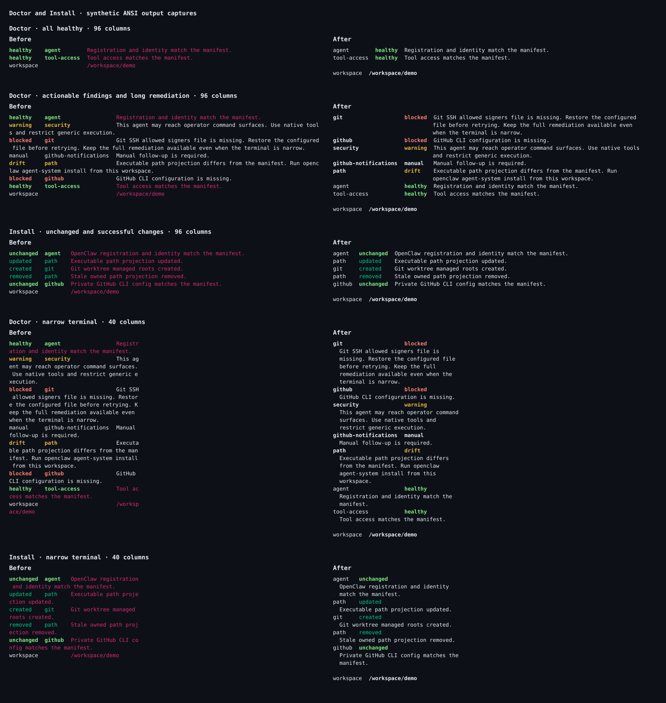
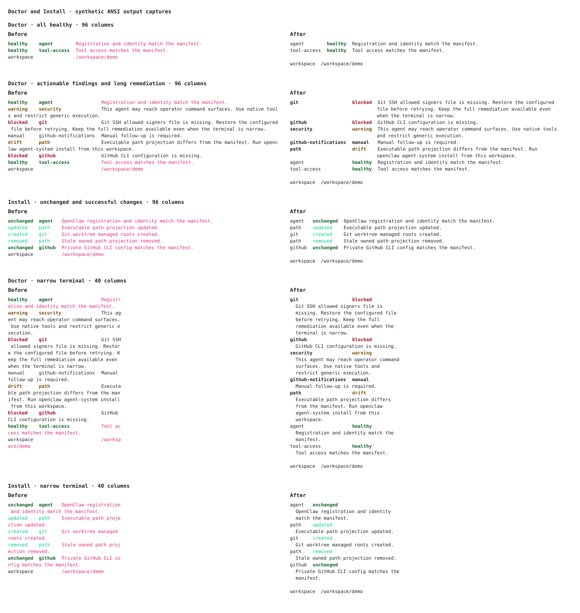

# Doctor and Install output captures

These before/after captures use synthetic lifecycle results, not findings from
any operator's machine. They cover all-healthy Doctor output; blocked, warning,
manual, and drift findings; long remediation; every Install outcome; and
96-column and 40-column terminals.

| Dark palette                       | Light palette                        |
| ---------------------------------- | ------------------------------------ |
| [View full-size capture](dark.svg) | [View full-size capture](light.svg)  |
|  |  |

The captures render actual ANSI output. “Before” uses the unchanged generic
summary renderer with the original Doctor/Install mapping. “After” invokes both
command handlers with injected services. Physical terminal wrapping is modeled
without word wrapping; the new renderer supplies its own word-aware line breaks.
Palettes and faint-text opacity are representative: terminals control their
exact colors and contrast.

Regenerate from the repository root:

```sh
bun run capture:lifecycle
```

This does not inspect or modify OpenClaw, discover a real manifest, install an
agent, or contact a Gateway. Layout, styles, sorting, JSON, diagnostic routing,
and exit codes have separate deterministic regression coverage.
